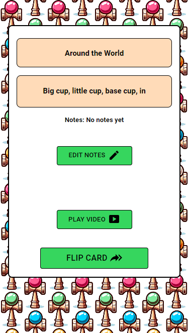
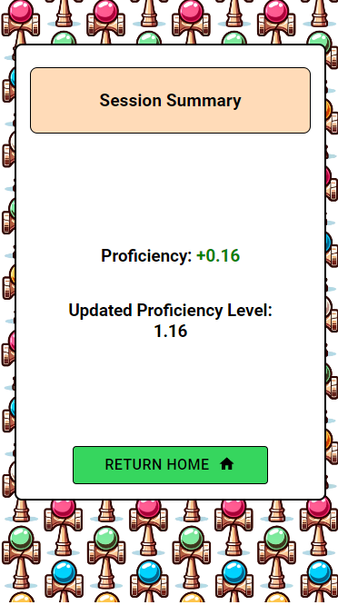

---

<p align="center"> Migaku (磨く) is an app to help you progress, organize, and track your improvement playing kendama. </p>

# Features

- A spaced-repetition approach to provide the user with tricks to practice based on their current skill level
- Users track their progress and see how they have improved over time via session history (to be implemented)
- Kendama World Cup (KWC) official videos are linked to each trick along with text descriptions to help users understand how to perform the trick
- Users can add a note for themselves

## How it Works

- The user self-reports the number of attempts to land a trick and the algorithm adjusts the user's proficiency level accordingly
- After the user has completed a session, their net proficiency level is re-calculated and they are provided with tricks at their level

<table>
  <tr>
    <td>
      <figure>
        
        <figcaption>Front of Session Card</figcaption>
      </figure>
    </td>
    <td>
      <figure>
        
        <figcaption>Back of Session Card</figcaption>
      </figure>
    </td>
  </tr>
  <tr>
    <td>
      <figure>
        
        <figcaption>Session Summary</figcaption>
      </figure>
    </td>
    <td>
      <figure>
        
        <figcaption>Results</figcaption>
      </figure>
    </td>
  </tr>
</table>

## Development Setup Instructions

Before you get started, make sure you have the following software installed on your computer:

- [Node.js](https://nodejs.org/en/)
- [PostrgeSQL](https://www.postgresql.org/)
- [Nodemon](https://nodemon.io/)

- Run `npm install`
- Create a `.env` file at the root of the project and paste this line into the file:
  ```
  SERVER_SESSION_SECRET=superDuperSecret
  ```
  While you're in your new `.env` file, take the time to replace `superDuperSecret` with some long random string like `25POUbVtx6RKVNWszd9ERB9Bb6` to keep your application secure. Here's a site that can help you: [https://passwordsgenerator.net/](https://passwordsgenerator.net/). If you don't do this step, create a secret with less than eight characters, or leave it as `superDuperSecret`, you will get a warning.
- Start postgres if not running already by using `brew services start postgresql`
- Run `npm run server`
- Run `npm run client`
- Navigate to `localhost:3000`

## Production Build

Before pushing to Heroku, run `npm run build` in terminal. This will create a build folder that contains the code Heroku will be pointed at. You can test this build by typing `npm start`. Keep in mind that `npm start` will let you preview the production build but will **not** auto update.

- Start postgres if not running already by using `brew services start postgresql`
- Run `npm start`
- Navigate to `localhost:5000`

## Deployment

1. Create a new Heroku project
1. Link the Heroku project to the project GitHub Repo
1. Create an Heroku Postgres database
1. Connect to the Heroku Postgres database from Postico
1. Create the necessary tables
1. Add an environment variable for `SERVER_SESSION_SECRET` with a nice random string for security
1. In the deploy section, select manual deploy

<p align="center">
  
</p>
